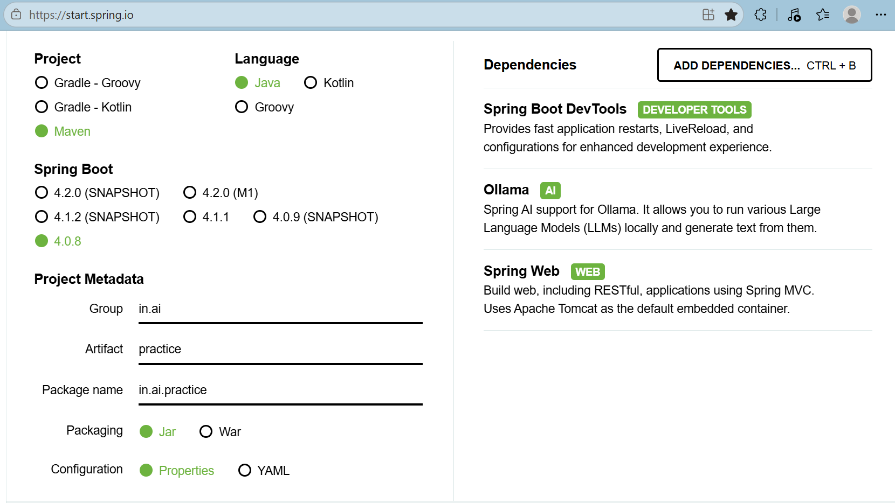

# Getting Started

### Reference Documentation
For further reference, please consider the following sections:

* [Official Apache Maven documentation](https://maven.apache.org/guides/index.html)
* [Spring Boot Maven Plugin Reference Guide](https://docs.spring.io/spring-boot/4.0.8/maven-plugin)
* [Create an OCI image](https://docs.spring.io/spring-boot/4.0.8/maven-plugin/build-image.html)
* [Spring Boot DevTools](https://docs.spring.io/spring-boot/4.0.8/reference/using/devtools.html)
* [Ollama](https://docs.spring.io/spring-ai/reference/api/chat/ollama-chat.html)
* [Spring Web](https://docs.spring.io/spring-boot/4.0.8/reference/web/servlet.html)

### Guides
The following guides illustrate how to use some features concretely:

* [Building a RESTful Web Service](https://spring.io/guides/gs/rest-service/)
* [Serving Web Content with Spring MVC](https://spring.io/guides/gs/serving-web-content/)
* [Building REST services with Spring](https://spring.io/guides/tutorials/rest/)

### Maven Parent overrides

Due to Maven's design, elements are inherited from the parent POM to the project POM.
While most of the inheritance is fine, it also inherits unwanted elements like `<license>` and `<developers>` from the parent.
To prevent this, the project POM contains empty overrides for these elements.
If you manually switch to a different parent and actually want the inheritance, you need to remove those overrides.

Application created: https://start.spring.io/

# Spring AI - ChatClient Reference

📖 Prompt Template Reference: [Spring AI Docs](https://docs.spring.io/spring-ai/reference/api/prompt.html)

---

## ChatClient Builder Support

- **defaultAdvisors()**
    - Recommended to use `defaultAdvisors` instead of `advisors`
- **defaultSystem()**
- **defaultUser()**
- **defaultOptions()**
    1. `model()` → select a specific model
    2. `temperature()` → controls creativity (0 = deterministic, 1 = highly creative)
    3. `maxCompletionTokens(200)` → max tokens for response generation
    4. `maxTokens(300)` → total max tokens (request + response)
    5. `topP(1)` → controls randomness
    6. `topK()` → controls how many top choices are considered  
       *(e.g., "Fun fact about India" → can return 100 facts, limit to top 5)*
    7. `frequencyPenalty()` → reduces repetition (higher = less repetition)
    8. `stopSequences` → stop generating when specific phrases are found
- **defaultTool()**

---

## ChatClient Methods

- **advisors()**
- **system()**
- **user()**
- **options()**
- **tool()**

## DB Console 
http://localhost:8080/h2-console
SELECT * FROM SPRING_AI_CHAT_MEMORY;